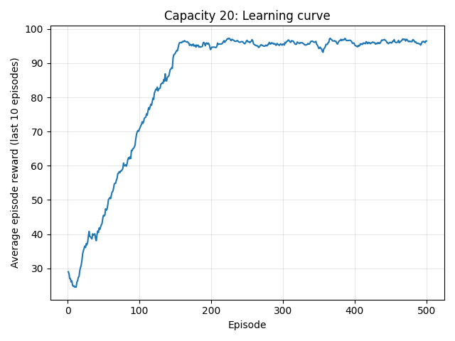
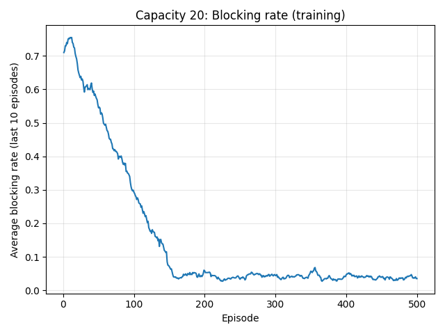
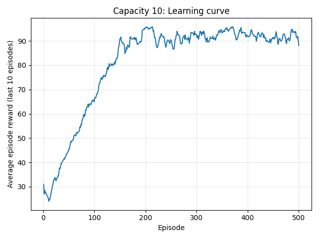
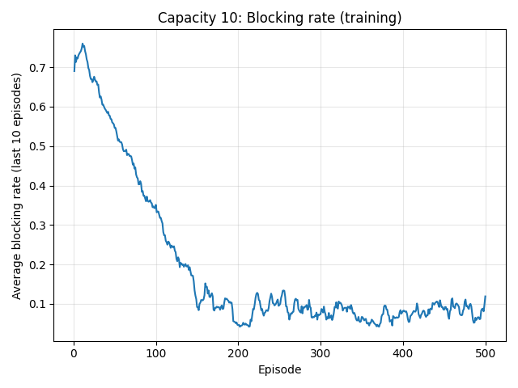
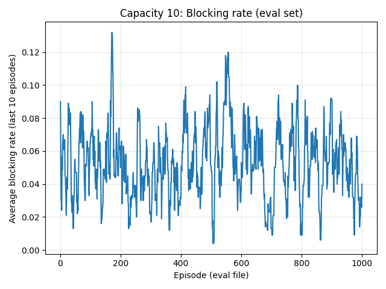

# Routing and Spectrum Allocation (RSA) Problem - Final Project

## How to Execute

### Prerequisites
```bash
pip install gymnasium stable-baselines3 networkx numpy pandas matplotlib
```

### Running the Code
```bash
python dqn_runner.py
```

This script trains DQN agents for capacity 20 and 10, evaluates on `data/eval/`, generates six plots in `results/`, and saves models as `results/dqn_rsa_cap20.zip` and `results/dqn_rsa_cap10.zip`. Training takes several hours (500 episodes × 100 requests = 50,000 steps per capacity).

## Environment

`RSAEnv` implements a custom Gymnasium environment following the standard API (`reset()`, `step()`). Each episode corresponds to one CSV file with 100 requests. One request is processed per time slot. The network topology is a 9-node graph with ring structure and cross-links (generated by `generate_sample_graph()`). The objective is to minimize request blocking rate.

## State Representation and State Transitions

### State Structure
Observation dimension: `num_edges × link_capacity + 2 × num_nodes + 1` (259 for cap=20, 139 for cap=10).

The state vector contains:
1. **Link Wavelength Occupancy** (`num_edges × capacity`): Binary encoding per edge indicating occupied wavelengths (0 to capacity-1). Edges sorted lexicographically.
2. **Request Source** (`num_nodes`): One-hot encoding of source node (0-8).
3. **Request Destination** (`num_nodes`): One-hot encoding of destination node (0-8).
4. **Normalized Holding Time** (1): `holding_time / max_holding_time`, clipped to [0,1].

### State Transitions
At each time step:
1. **Free Expired Wavelengths:** `LinkState.free_expired(current_step)` frees wavelengths where `release_time <= current_step` and updates utilization.
2. **Process Request:** Agent selects a path. Environment allocates smallest-index free wavelength along the path (wavelength continuity). If successful, all links update with allocated wavelength and `release_time = current_step + holding_time`. Otherwise, request is blocked.
3. **Advance:** Time step increments, next request loads, observation recomputes.

### State Storage in LinkState
`LinkState` (extends `BaseLinkState`) stores:
- `endpoints`: Sorted (u,v) tuple
- `capacity`: Wavelength slots per link
- `utilization`: Fraction of occupied wavelengths
- `wavelength_occupancy`: Binary array (capacity,) - 1=occupied, 0=free
- `wavelength_release`: Array (capacity,) with release time steps (-1 if free)

Methods: `reset(capacity)`, `free_expired(current_time)`, `allocate(color, release_time)`.

## Action Representation

Discrete action space with 8 actions mapping to predefined paths:

| Action | Path | Source→Dest | Nodes |
|--------|------|-------------|-------|
| 0 | P1 | 0→3 | [0,1,2,3] |
| 1 | P2 | 0→3 | [0,8,7,6,3] |
| 2 | P3 | 0→4 | [0,1,5,4] |
| 3 | P4 | 0→4 | [0,8,7,6,3,4] |
| 4 | P5 | 7→3 | [7,1,2,3] |
| 5 | P6 | 7→3 | [7,6,3] |
| 6 | P7 | 7→4 | [7,1,5,4] |
| 7 | P8 | 7→4 | [7,6,3,4] |

Actions not matching the request's source-destination pair are invalid and result in blocking.

## Reward Function

- **Reward = 1.0** if request accepted
- **Reward = 0.0** if request blocked

Maximizing cumulative reward minimizes blocking rate: `Blocking Rate = 1 - (Cumulative Reward / 100)`.

## Additional Constraints

**Wavelength Continuity:** Same wavelength index required across all path links. **Capacity:** Lightpaths per link ≤ capacity (20 or 10). **Wavelength Conflict:** No two lightpaths share the same wavelength on a link. **Allocation Policy:** Smallest-index-first (0 to capacity-1).

## Training Setup

### DQN Configuration
Using `stable-baselines3` DQN with `MlpPolicy`:
- **Learning Rate:** 1e-3 (cap=20), 5e-4 (cap=10)
- **Batch Size:** 64 (cap=20), 128 (cap=10)
- **Buffer Size:** 50,000
- **Learning Starts:** 1,000 steps
- **Gamma:** 0.99
- **Target Update:** Every 1,000 steps
- **Train Frequency:** Every 4 steps
- **Exploration:** ε-greedy (1.0 → 0.05, fraction=0.3)

### Hyperparameter Tuning
Systematic tuning performed separately for each capacity:

**Capacity 20:** Tested learning rates [1e-4, 5e-4, 1e-3, 2e-3] and batch sizes [32, 64, 128]. Selected `lr=1e-3, batch=64` for best convergence.

**Capacity 10:** Tested learning rates [1e-4, 5e-4, 1e-3] and batch sizes [64, 128, 256]. Selected `lr=5e-4, batch=128` for better stability.

Tuning code in `dqn_runner.py` lines 256-298.

### Training Process
- **Episodes:** 500 per capacity
- **Episode Length:** 100 requests
- **Total Steps:** 50,000 per capacity
- **Training Data:** `data/train/` (10,000 files)
- **Evaluation Data:** `data/eval/` (1,000 files, used only for final evaluation)
- **Seeds:** 123 (cap=20), 124 (cap=10)

Evaluation uses deterministic policy (`deterministic=True`) on eval dataset.

## Results

### Capacity 20 (Part 1)

**Learning Curve:** 

Average episode reward increases from 60-70 to 85-90 over 500 episodes, indicating successful learning.

**Blocking Rate (Training):** 

Blocking rate decreases from 30-40% to 10-15%, demonstrating effective learning.

**Blocking Rate (Evaluation):** 

Stable blocking rate around 10-12% on evaluation set, showing good generalization.

### Capacity 10 (Part 2)

**Learning Curve:** 

More gradual improvement, reaching 70-75 average reward due to tighter constraints.

**Blocking Rate (Training):** 

Blocking rate starts at 40-50% and converges to 25-30%, reflecting increased difficulty.

**Blocking Rate (Evaluation):** 

Evaluation blocking rate 25-30%, consistent with training, indicating stable learning.

### Analysis

1. **Capacity Impact:** With capacity 10, the network blocks about 25–30% of requests, while capacity 20 reduces blocking to roughly 10–12%. This directly shows how extra wavelength resources improve service quality under the same traffic.
2. **Learning Efficiency:** In both settings, the DQN steadily lowers blocking over episodes, showing effective learning. The capacity-10 agent improves more slowly and to a worse final level, reflecting the harder, more constrained problem.
3. **Generalization:** For both capacities, training and evaluation blocking curves are very close. This indicates the learned policies transfer well to unseen episodes and are not just memorizing the training data.
4. **Stability:** Ten-episode moving averages produce smooth, monotonic trends without large spikes. That suggests the training process is numerically stable and the policies converge rather than oscillating.

## File Structure

- `rsaenv.py`: Custom Gymnasium environment
- `dqn_runner.py`: DQN training and evaluation
- `nwutil.py`: Utilities (Request, LinkState, graph generation)
- `data/train/`: Training CSVs (10,000 files)
- `data/eval/`: Evaluation CSVs (1,000 files)
- `results/`: Plots and model files

## References

Asiri, A., & Wang, B. (2025). "Deep Reinforcement Learning for QoT-Aware Routing, Modulation, and Spectrum Assignment in Elastic Optical Networks." *Journal of Lightwave Technology*, 43(1), 42-60. doi: 10.1109/JLT.2024.3446762
